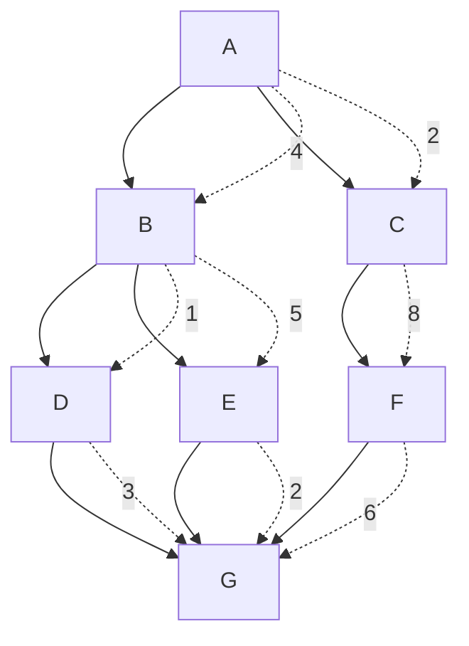

# 01-dijkstra: ダイクストラ法による最短経路探索

このプロジェクトでは、ネットワーク上の最短経路を探索するダイクストラ法を実装します。

## サンプルネットワーク

以下のようなネットワークで最短経路を探索します：



## ネットワーク詳細

- **ノード**: A, B, C, D, E, F, G
- **エッジと重み**:
  - A → B: 4
  - A → C: 2  
  - B → D: 1
  - B → E: 5
  - C → F: 8
  - D → G: 3
  - E → G: 2
  - F → G: 6

## 期待される最短経路

- **A → G**: A → B → D → G (距離: 8)
- **A → E**: A → B → E (距離: 9)
- **A → F**: A → C → F (距離: 10)

## セットアップ

```bash
cd examples/01-dijkstra
pnpm install
pnpm test
```

## ファイル構成

```
01-dijkstra/
├── package.json
├── vitest.config.js
├── src/
│   ├── dijkstra.ts          # ダイクストラ法の実装
│   ├── graph.ts             # グラフデータ構造
│   └── dijkstra.test.ts     # テストファイル
└── README.md
```